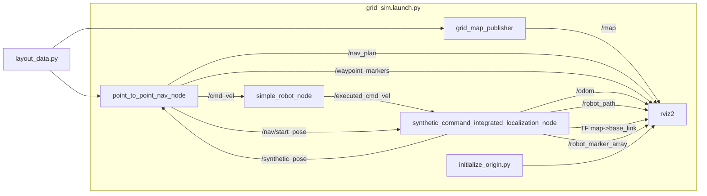
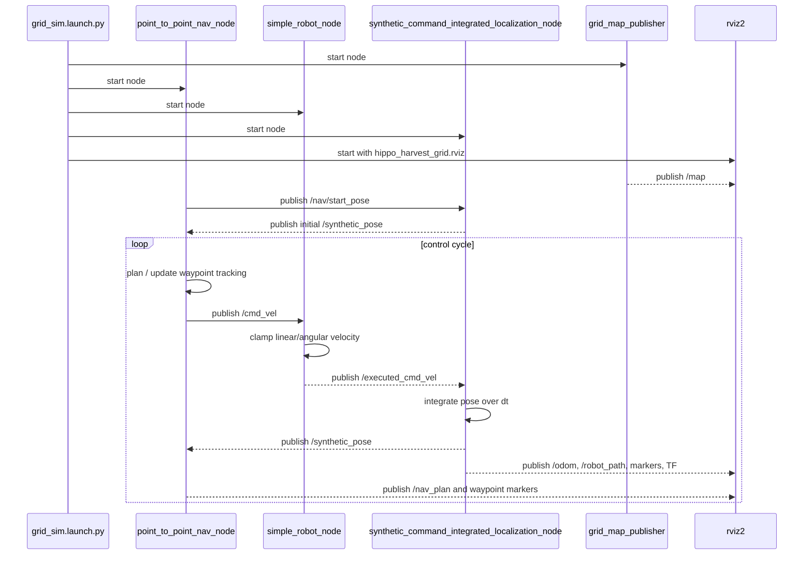
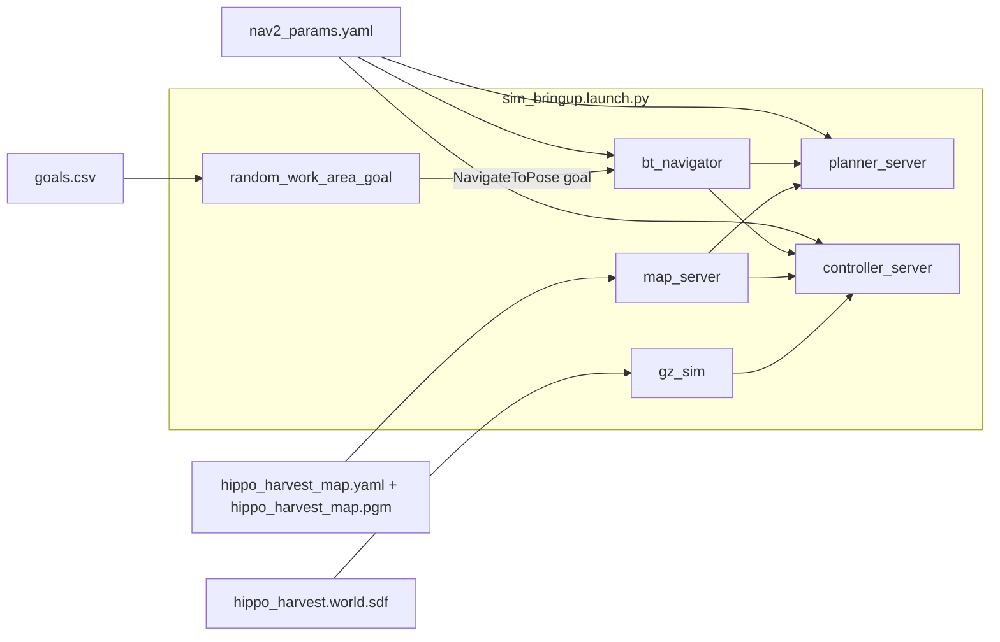
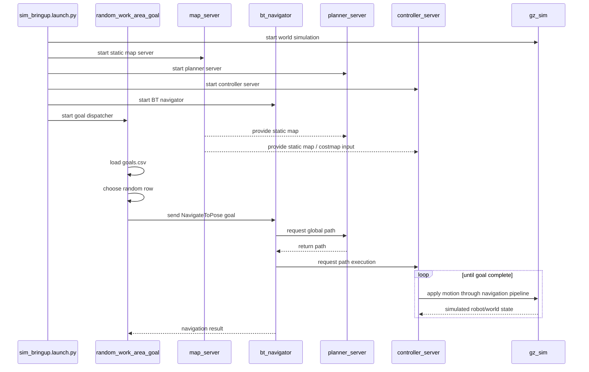

# Hippo Harvest Simulation Environment

This document explains how the simulation environment is structured, which launch paths exist, and how data moves between the main ROS 2 components.

## Overview

The simulation package lives in `simulation/ros2_ws/src/hippo_harvest_sim` and currently supports two different runtime modes:

1. `grid_sim.launch.py`
   Runs a lightweight, code-driven grid simulation without Gazebo.
2. `sim_bringup.launch.py`
   Runs the larger world-based simulation with Gazebo and Nav2.

These two modes solve different problems:

- The grid sim is a fast local loop for occupancy-grid publishing, simple path planning, command limiting, synthetic localization, and RViz visualization.
- The bringup sim is a more standard Nav2 stack using a static map, Gazebo world, and a goal dispatcher that sends navigation goals to Nav2.

## Main Files

- `launch/grid_sim.launch.py`: starts the lightweight grid simulation.
- `launch/sim_bringup.launch.py`: starts the Gazebo + Nav2 simulation.
- `hippo_harvest_sim/layout_data.py`: defines the grid size, table layout, blocked cells, and helper geometry functions.
- `hippo_harvest_sim/grid_map_publisher.py`: publishes the `/map` occupancy grid for the grid sim.
- `hippo_harvest_sim/point_to_point_nav_node.py`: computes and follows grid-based routes in the lightweight sim.
- `hippo_harvest_sim/simple_robot_node.py`: clamps incoming velocity commands and republishes the commands the robot can actually execute.
- `hippo_harvest_sim/synthetic_command_integrated_localization_node.py`: integrates executed velocity commands into a synthetic pose, odometry, path, TF, and visualization outputs.
- `hippo_harvest_sim/random_work_area_goal.py`: loads `goals.csv`, picks a goal, and sends it to Nav2 in the Gazebo/Nav2 flow.
- `maps/empty_grid_map.*`: packaged map artifacts for the lightweight grid sim.
- `maps/hippo_harvest_map.*`: static map for the Gazebo/Nav2 flow.
- `maps/goals.csv`: candidate navigation goals for `random_work_area_goal.py`.
- `config/nav2_params.yaml`: Nav2 parameters for the bringup flow.
- `worlds/hippo_harvest.world.sdf`: Gazebo world file used by `sim_bringup.launch.py`.

## Grid Simulation Flow

`grid_sim.launch.py` starts these nodes:

- `swri_transform_util/initialize_origin.py`
- `hippo_harvest_sim/grid_map_publisher`
- `hippo_harvest_sim/simple_robot_node`
- `hippo_harvest_sim/synthetic_command_integrated_localization_node`
- `hippo_harvest_sim/point_to_point_nav_node`
- `rviz2`

### What each node does

#### `grid_map_publisher`

This node builds an `OccupancyGrid` from the table layout defined in `layout_data.py`.

- Grid resolution: `0.025 m`
- Grid size: `180 x 135` cells
- Occupied cells come from `hard_occupied_cells()`
- Publishes `/map` with transient-local durability so late subscribers can still receive the latest map

#### `point_to_point_nav_node`

This is the lightweight planner/controller for the grid sim.

- Uses `layout_data.py` to derive free space and table approach cells
- Starts from `default_start_cell()`
- Plans with an internal A* search over 4-connected neighbors
- Publishes:
  - `/nav/start_pose`
  - `/waypoint_a`
  - `/waypoint_b`
  - `/waypoint_markers`
  - `/nav_plan`
  - `/cmd_vel`
- Subscribes to `/synthetic_pose`
- Walks through a hard-coded route of target workspaces

#### `simple_robot_node`

This node acts like a very simple actuator/safety layer.

- Subscribes to `/cmd_vel`
- Saturates commands to:
  - max linear speed: `0.10 m/s`
  - max angular speed: `0.6 rad/s`
- Publishes `/executed_cmd_vel`

This creates a distinction between commanded motion and motion the simulated robot can actually execute.

#### `synthetic_command_integrated_localization_node`

This node acts as the robot state estimator in the grid sim.

- Waits for `/nav/start_pose` to initialize the starting pose
- Subscribes to `/executed_cmd_vel`
- Integrates velocity at `10 Hz`
- Clamps the robot pose to the simulated grid bounds
- Publishes:
  - `/synthetic_pose`
  - `/odom`
  - `/robot_cell`
  - `/robot_path`
  - `/robot_marker`
  - `/robot_marker_array`
- Broadcasts TF from `map` to `base_link`

This means the grid sim does not depend on wheel encoders, AMCL, or Gazebo physics. It advances the robot state directly from the executed commands.

### Grid Sim Component Diagram

### Grid Sim Sequence Diagram

## Gazebo + Nav2 Bringup Flow

`sim_bringup.launch.py` starts these nodes:

- `ros_gz_sim/gz_sim`
- `nav2_map_server/map_server`
- `nav2_planner/planner_server`
- `nav2_controller/controller_server`
- `nav2_bt_navigator/bt_navigator`
- `hippo_harvest_sim/random_work_area_goal`

### What each component does

#### Gazebo

Gazebo starts from `worlds/hippo_harvest.world.sdf` and provides the world simulation runtime.

#### Nav2 map server and stack

The Nav2 side is configured from:

- `maps/hippo_harvest_map.yaml`
- `config/nav2_params.yaml`

The launch file wires in:

- `map_server`: publishes the static map
- `planner_server`: computes global plans with `NavfnPlanner`
- `controller_server`: follows the generated path with `DWBLocalPlanner`
- `bt_navigator`: runs the high-level navigation behavior tree

A few notable parameter choices from `nav2_params.yaml`:

- `global_frame: map`
- `robot_base_frame: base_link`
- `odom_topic: /odom`
- global costmap uses `static_layer` and `inflation_layer`
- local costmap uses `obstacle_layer` and `inflation_layer`
- planner is configured with `use_astar: true`

#### `random_work_area_goal`

This node is the goal source for the bringup flow.

- Loads rows from `maps/goals.csv` or falls back to `simulation/layout/goals.csv`
- Picks a row at random
- Converts `x_m`, `y_m`, and `yaw_rad` into a `PoseStamped`
- Uses `nav2_simple_commander.BasicNavigator` to call `goToPose(...)`
- Waits for completion and then can dispatch another goal later

### Bringup Component Diagram

### Bringup Sequence Diagram

## Geometry and Map Modeling

The lightweight grid environment is not loaded from the `.pgm` map image at runtime. Instead, it is generated from `layout_data.py`.

Key geometry rules:

- Workspace tables are generated procedurally in a 3-row by 4-column arrangement.
- Each table occupies a block of cells in the occupancy map.
- Planning uses a larger occupied set than visualization by adding table and wall buffers.
- Approach waypoints are placed along the south edge of each workspace.

This separation is important:

- `hard_occupied_cells()` defines the visually occupied cells published to `/map`.
- `planning_occupied_cells()` adds safety margins so the path planner avoids driving too close to tables and walls.

## Topics and Data Products

### Grid sim topics

- `/map`: occupancy grid for visualization and planning context
- `/cmd_vel`: desired robot motion from the planner/controller node
- `/executed_cmd_vel`: actuator-limited velocity actually applied to the robot state
- `/synthetic_pose`: synthetic robot pose in the `map` frame
- `/odom`: synthetic odometry
- `/nav/start_pose`: initial pose for the synthetic localization node
- `/nav_plan`: planned path published for visualization
- `/waypoint_a`, `/waypoint_b`: waypoint poses for visualization/debugging
- `/waypoint_markers`: workspace and route markers
- `/robot_path`: accumulated historical path
- `/robot_marker`, `/robot_marker_array`: robot visualization markers
- TF `map -> base_link`: pose transform used by RViz and other ROS tools

### Bringup inputs

- `hippo_harvest_map.yaml` and `hippo_harvest_map.pgm`: static map for Nav2
- `goals.csv`: precomputed goal positions and headings
- `nav2_params.yaml`: navigation stack behavior and costmap settings
- `hippo_harvest.world.sdf`: Gazebo world definition

## Launcher Scripts

- `simulation/scripts/run_with_rviz.sh`: starts the lightweight custom grid simulation with RViz.
- `simulation/scripts/run_nav2_rviz.sh`: starts Nav2 with the static grid map and RViz, without Gazebo.
- `simulation/scripts/run_nav2_gazebo.sh`: starts the Gazebo-based bringup path with Nav2.

## Operational Summary

If you want a fast developer-facing simulation loop, use `grid_sim.launch.py`.

- The map is synthesized from Python geometry.
- The planner is local to `point_to_point_nav_node.py`.
- The robot state is integrated from executed commands.
- RViz is the main visualization surface.

If you want the larger map-and-goal navigation stack, use `sim_bringup.launch.py`.

- Gazebo runs the world.
- Nav2 owns planning and path execution.
- A static map is loaded from the packaged map files.
- `random_work_area_goal.py` dispatches goals from `goals.csv`.

## Current Limitations

- The grid sim is intentionally synthetic and does not model sensor noise, wheel slip, or physics.
- `point_to_point_nav_node.py` currently uses hard-coded target workspace IDs.
- `random_work_area_goal.py` selects a goal randomly instead of using a task scheduler.
- The bringup launch file starts core Nav2 nodes directly, but does not include a full localization pipeline in this package.
